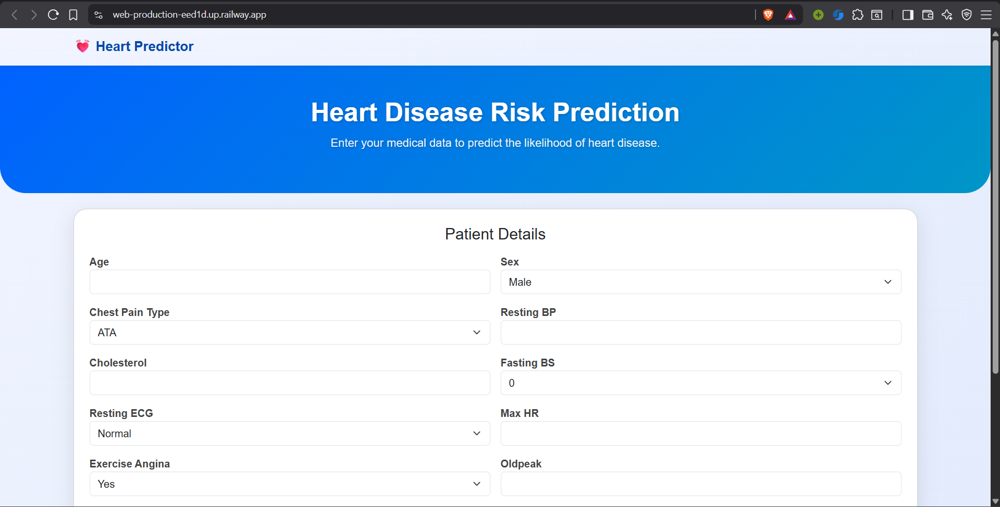
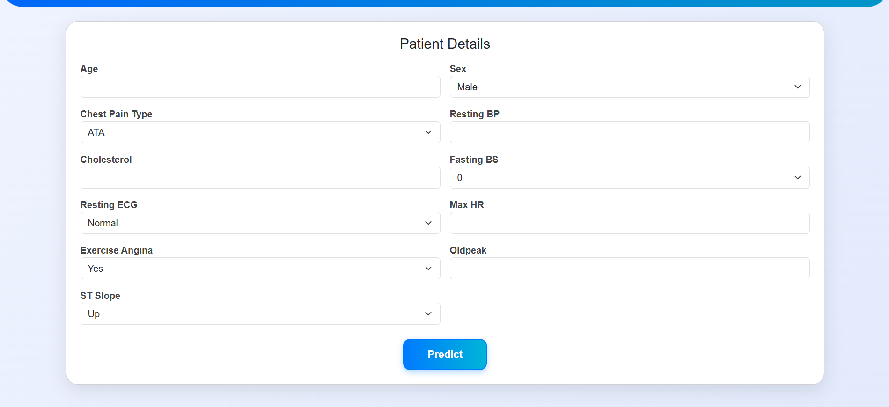
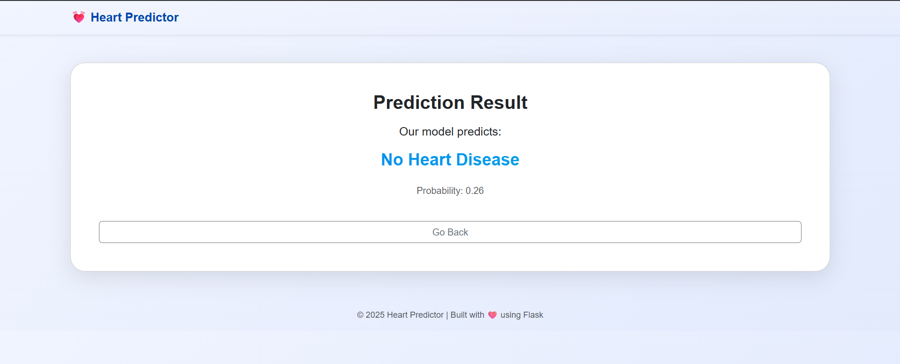

# Heart-Disease-Predictor

A web application built as an practice project that demonstrates a production grade ML project. It tells the likelihood of heart disease using machine learning. Built with **Flask**, HTML templates, and a trained ML model. The app provides both a **web interface** and a **REST API** for predictions.

---

## Features

- Predict heart disease based on common health metrics.
- Simple and user-friendly web interface.
- RESTful API endpoint (`/predict_api`) for programmatic access.
- Uses a pre-trained ML model with a full preprocessing pipeline.
- Styled using custom CSS (`style.css`).

---

## Software and Tools Required

- [GitHub](https://github.com/) account  
- [VSCode](https://code.visualstudio.com/) or any Python IDE  
- [Python 3.11+](https://www.python.org/)  
- [Git CLI](https://git-scm.com/downloads)  

---

## Setup Instructions

### 1️ Clone the repository

```bash
git clone https://github.com/Sukrat-Singh/heart-disease-predictor.git
cd heart-disease-predictor
```

### 2 Create a Virtual Environment

```bash
python -m venv venv
```

**Activate the virtual environment:**

 - Windows:
```bash
venv\Scripts\activate
```

 - Mac/Linux:
```bash
source venv/bin/activate
```


### 3️ Install dependencies

```bash
pip install -r requirements.txt
```

### 4️ Run the application locally

```bash
python app.py
```

**Open your browser at http://127.0.0.1:5000 to view the web interface.**

---

## Folder Structure

```
heart-disease-predictor/
├─ data/ # dataset 
├─ models/
│ └─ heart_disease_model.pkl # Trained ML model
├─ static/ # CSS
├─ templates/
│ ├─ home.html
│ └─ result.html
├─ .gitignore
├─ LICENSE
├─ Procfile # For deployment on Railway/Heroku
├─ README.md
├─ app.py # Flask application
├─ heart.ipynb # Jupyter notebook (for experiments)
└─ requirements.txt # Python dependencies
```

---

## API Usage

 - Endpoint: `/predict_api`
 - Method: `POST`
 - `Payload example`:

```
{
  "data": {
    "Age": 55,
    "Sex": "M",
    "ChestPainType": "ATA",
    "RestingBP": 130,
    "Cholesterol": 250,
    "FastingBS": 1,
    "RestingECG": "Normal",
    "MaxHR": 150,
    "ExerciseAngina": "N",
    "Oldpeak": 1.5,
    "ST_Slope": "Up"
  }
}
```

`Response example`:
```
{
  "prediction": 1,
  "probability": 0.82
}
```

---

## Deployment

This app can be deployed for free on Railway or Render using your existing Flask setup:

Ensure Procfile contains:
```
web: gunicorn app:app
```

Ensure requirements.txt includes:
```
Flask==2.3.4
Flask-RESTful==1.1.1
gunicorn==23.0.0
pandas==2.2.2
numpy==1.26.4
scikit-learn==1.5.1
joblib==1.4.2
python-dotenv==1.0.1
```

Push your repository to GitHub.

Connect your GitHub repo on Railway or Render and deploy.

---

## Screenshots

**Web app can be seen at : https://web-production-eed1d.up.railway.app/**







---

## Future Enhancements

 - Add Docker support for easier deployment and consistent environments.
 - CI/CD using GitHub Actions to automate testing and deployment.
 - Implement REST API endpoints for integration with other applications.
 - Improve UI/UX for better user experience.
 - Add data validation and error handling to ensure robust input processing.

## Credits

Developed by `Sukrat Singh`

Machine learning model built using `scikit-learn`
